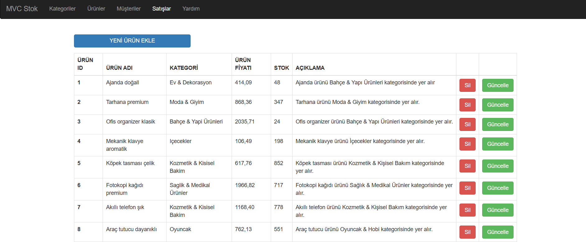
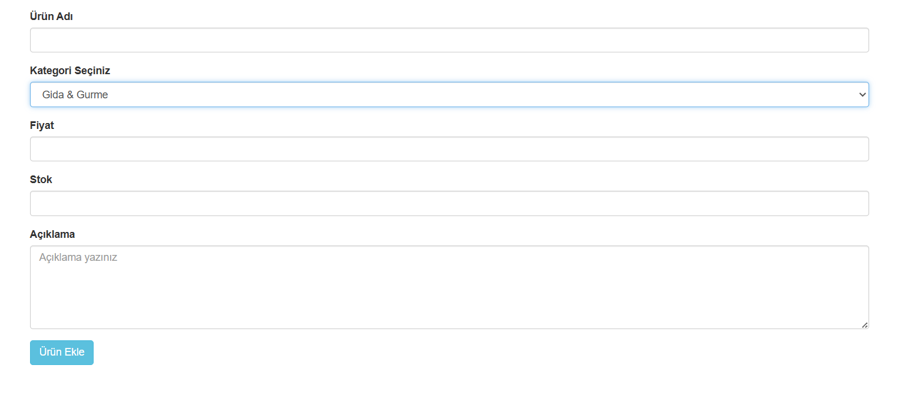
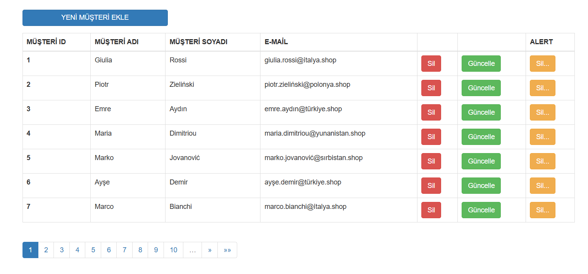
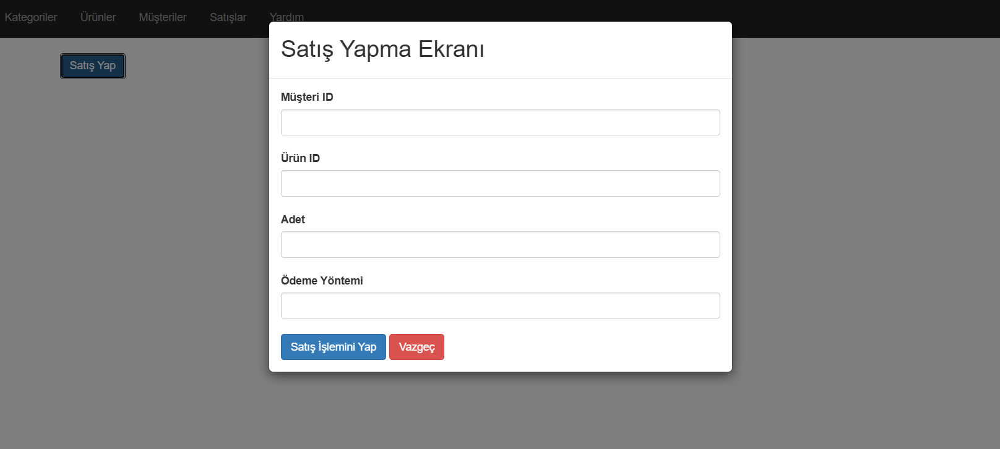

# 🛒 MVCProje: Gelişmiş Ticaret ve Veri Yönetim Sistemi

Bu proje, **.NET Framework MVC** mimarisi kullanılarak geliştirilmiş; Ürün, Kategori, Müşteri ve Satış süreçlerini yöneten bir web uygulamasıdır.

---

## 🚀 Öne Çıkan Özellikler

### 1. 🗂️ Gelişmiş CRUD ve İlişkisel Veri Yönetimi
* **Ürün Yönetimi:** Ürünlerin bağlı olduğu kategorilerle birlikte listelenmesi ve güncellenmesi. Yeni ürün ekleme ekranında, veritabanındaki kategoriler dinamik olarak bir **DropdownList (Açılır Liste)** ile çekilerek ilişkisel veri yapısının korunması ve hatalı veri girişinin engellenmesi sağlanmıştır.
* **Müşteri Yönetimi:** Müşteri bilgileri güvenli bir şekilde güncellenebilir ve iki kademeli silme mekanizmasıyla yönetilir.
* **Sayfalama (PagedList):** Veri yoğunluğunu azaltmak ve sayfa yüklenme performansını artırmak amacıyla tüm listeleme ekranlarında **PagedList** entegrasyonu kullanılmıştır. Her sayfada optimize edilmiş şekilde **7 kayıt** gösterilmektedir.

### 2. 🛡️ Veritabanı Güvenliği: Soft Delete (Yumuşak Silme)
Projede `Kategori -> Ürün` gibi tablolar arasında bire-çok (*one-to-many*) ilişkisel bağlar bulunmaktadır. Yabancıl anahtar (*Foreign Key*) kısıtlamalarının veritabanında hataya (`SqlException`) yol açmasını ve veri geçmişinin kaybolmasını önlemek adına **Soft Delete (Yumuşak Silme)** mimarisi uygulanmıştır:
* Veritabanından satırlar fiziksel olarak silinmez (`DELETE FROM` yerine `UPDATE` sorgusu çalışır).
* Silinen kayıtların `IsDeleted` alanı `1 (true)` yapılır.
* Listeleme ekranlarında sadece `IsDeleted = 0` olan güncel veriler süzülerek (`WHERE IsDeleted = 0`) kullanıcıya gösterilir.

### 3. 👤 Çift Kademeli Müşteri Silme Deneyimi
Müşteri modülünde veri kayıplarını engellemek ve kullanıcı deneyimini artırmak için iki farklı silme yöntemi sunulmuştur:
* **Normal Silme:** Doğrudan sistem üzerinden silme tetiklenir.
* **Alert ile Silme:** Kullanıcı silme butonuna bastığında dinamik bir uyarı (*Alert*) penceresi açılarak onay istenir. Yanlışlıkla tıklamaların önüne geçilir.

### 4. 💰 Popup Modalı ile Dinamik Satış Yönetimi
Satış bölümünde sayfa yenilenmeden hızlıca işlem yapabilmek için modern bir **Popup (Modal)** mimarisi kurulmuştur. "Satış Yap" butonuna tıklandığında açılan bu Popup üzerinden şu veriler toplanır:
* 🆔 **Ürün ID**
* 👤 **Müşteri ID**
* 📦 **Adet**
* 💳 **Ödeme Yöntemi** (Nakit, Kredi Kartı vb.)

---

## 🛠️ Teknolojik Altyapı

* **Framework:** .NET Framework MVC (C#)
* **Veritabanı Katmanı:** MS SQL Server & ADO.NET / LINQ to SQL
* **UI Bileşenleri:** Bootstrap, PagedList.Mvc, Javascript (Modals & Alerts), HTML, CSS

---

## 📂 Kurulum ve Çalıştırma

1. SQL Server Management Studio (SSMS) üzerinden `ShopBaseDb` veritabanınızı oluşturun ve `Products`, `Categories`, `Customers` tablolarına `IsDeleted (BIT)` kolonunu ekleyin.
2. Projeyi Visual Studio ile açın.
3. `Web.config` veya bağlantı sınıfınızdaki `ConnectionString` bilgisini kendi yerel SQL Server adresinize göre güncelleyin.
4. Projeyi `Build` edin ve tarayıcıda çalıştırın.